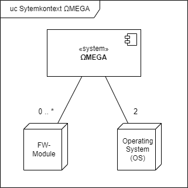
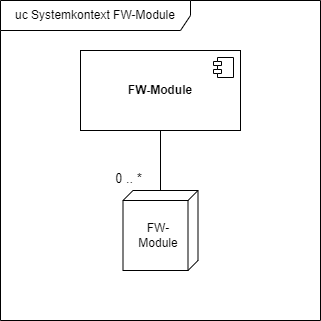

# Systemkontext

## FW-Module

Ein FW-Modul erweitert ΩMEGA. Ein FW-Modul wird von ΩMEGA geladen. Ein FW-Modul ist auf Linux Systemen eine Shared Library (.so Datei), auf VxWorks Sytemen eine Kernelapplikation (.out Datei).

Ein FW-Modul kann andere FW-Module verwenden.

## Operating System (OS)

ΩMEGA soll auf Platformen mit den Betriebssystemen Linux und VxWorks ausführbar sein.
